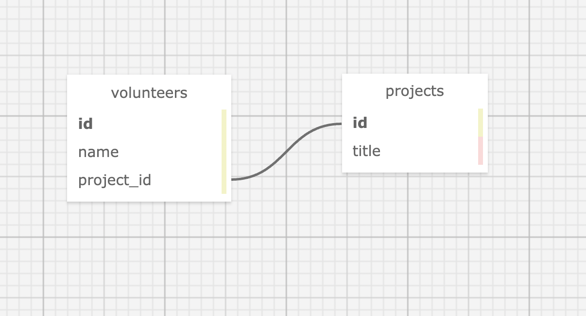

# Volunteer Tracker

#### By Morgan Waites
 
#### This is an app for tracking projects with volunteers.

## Technologies Used

* Ruby
* Gems
* Bundler
* Rspec
* Pry
* Sinatra
* Capybara
* Postgres
* SQL
* SQL Designer

## Description

  Webpage displays list of projects with tabs for volunteers as well. User has ability to add projects, update and delete them. Same with volunteers. Each project can have many volunteers, while volunteer can only have one project. Shows competency in CRUD functionality and Postgres and Sinatra framework and GET/POST routing.

## Setup/Installation Requirements

* Create and/or navigate to the directory you would like to contain this project on your computer.
* Type **git clone https://github.com/mellowmorgan/volunteer-ruby-project.git to clone the repository to your local machine.
* Navigate into project directory by typing cd volunteer-ruby-project
* Type bundle install in the terminal to populate gems
* To create a database using database backup included in this project, type in your terminal:   
      `createdb [DATABASE NAME]`  
      `psql [DATABASE_NAME] < database_backup.sql`  
      `createdb -T [DATABASE_NAME] [TEST_DATABASE_NAME]`
* After building the database, type rspec in the terminal to confirm passing of all tests  
* Type ruby app.rb to run the program with Sinatra
* Open browswer and enter the url "http://localhost:4567/" unless otherwise prompted in the terminal

## Known Bugs

* No known bugs

## License

[MIT](https://opensource.org/licenses/MIT)

If you have any issues, questions, ideas or concerns, please reach out to me at my email and/or make a contribution to the code via GitHub.  

Copyright (c) 2021 Morgan Waites

